# TUGAS 2 IF3110 PENGEMBANGAN APLIKASI BERBASIS WEB
# Engima

## Deskripsi Aplikasi Web
Engima adalah aplikasi pemesanan tiket bioskop. Pada halaman **Home**, pengguna disambut dengan "Hello, *username*" dan daftar film yang sedang tayang. Pada halaman **Search Result**, untuk setiap film, ditampilkan informasi judul, sinopsis, rating, poster. Pengguna dapat melihat detail film dengan mengklik tombol “View details”. Ketika memilih *page*, pengguna tidak diarahkan ke halaman baru namun daftar film langsung berubah di halaman search saat itu.
Pada halaman **Film Detail** terdapat beberapa informasi mengenai film yang dipilih, yaitu judul, poster, rating, genre (bisa lebih dari satu), tanggal rilis, durasi tayang (dalam menit), dan sinopsis dari film tersebut.
Pengguna dapat melakukan pembelian tiket dari halaman ini dengan memilih salah satu dari *schedule* pada tabel *schedule* yang tersedia.
Pengguna dapat melihat *Top 3 review* dari pengguna lain dan dari MovieDB API. Pada halaman **Buy Ticket**, pengguna dapat memilih salah satu kursi yang ingin dipesan (**tepat 1 kursi saja**) kemudian mengklik tombol *Buy Ticket* bila sudah milih kursi yang diinginkan.
Setelah mengklik tombol *Buy Ticket*, pengguna akan disodorkan tambilan *Payment Success* dan dapat mengklik tombol *Show Transaction History* untuk menuju ke catatan pembelian tiket pengguna.
Pada halaman **Transaction History**, pengguna dapat melihat list tiket film yang pernah dibeli. Bila waktu tayang film belum lewat maka pengguna belum bisa memberikan review. Bila sudah lewat waktu tayang, pengguna dapat memberikan review dan dapat mengubah atau menghapus review yang pernah diberikan.
Pada halaman **User Review**, pengguna dapat memberikan review film yang pernah ditonton dengan skala 1-10 dan memberikan komentar untuk review.

# Skema Basis data
   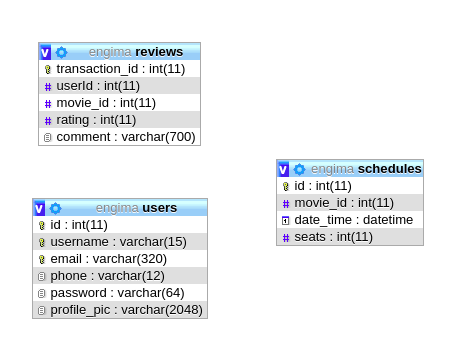
# *Screenshoot* Perubahan Tampilan Engima

1. Home: 
   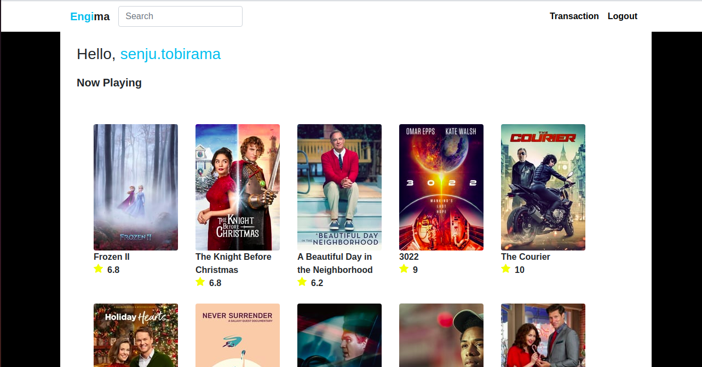
   
2. Detail:
   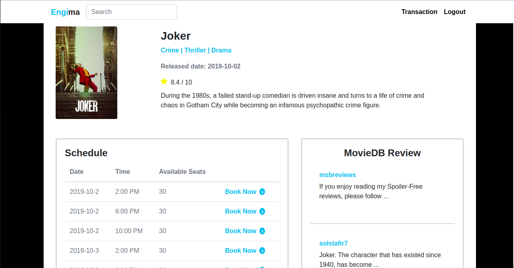
   
3. Booking:
  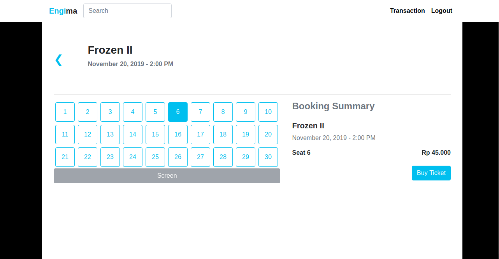
  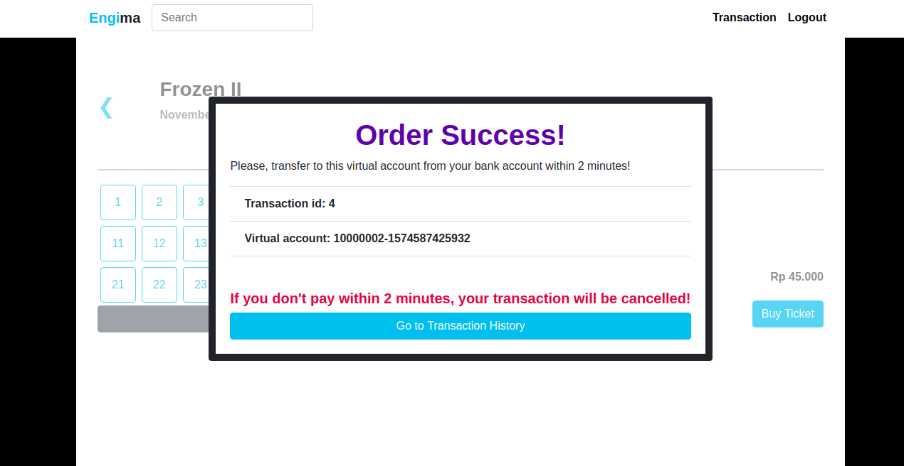
  
4. Search: 
  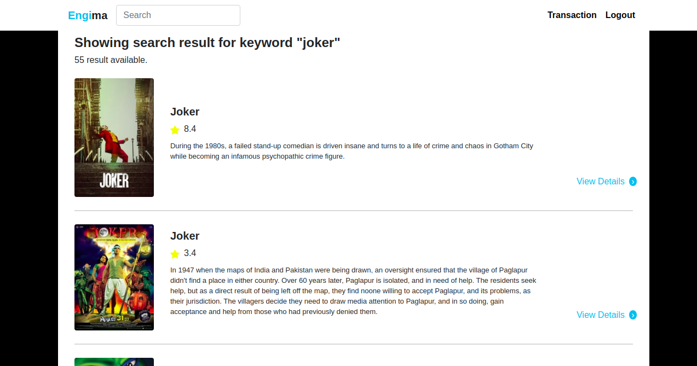
  
5. Transaction:
  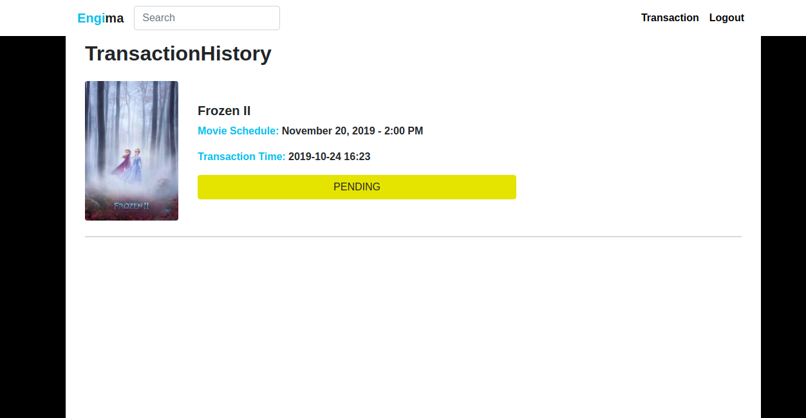
  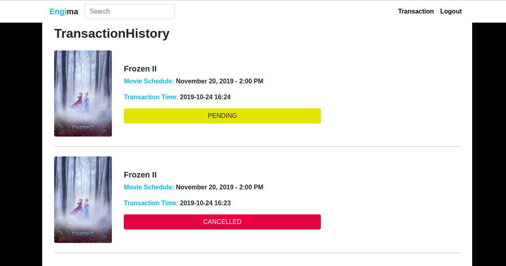
  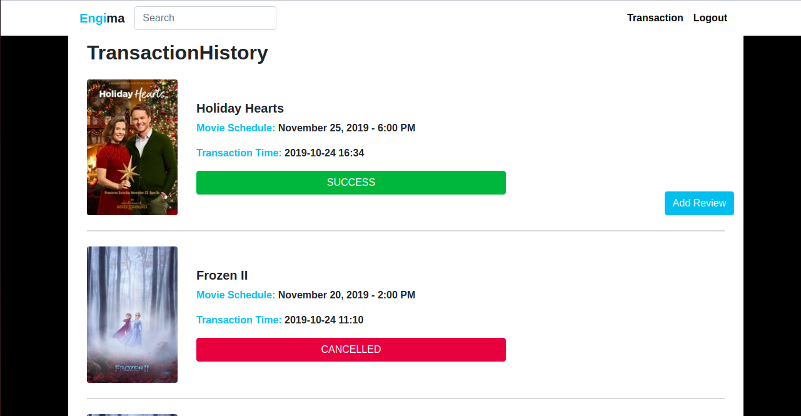
  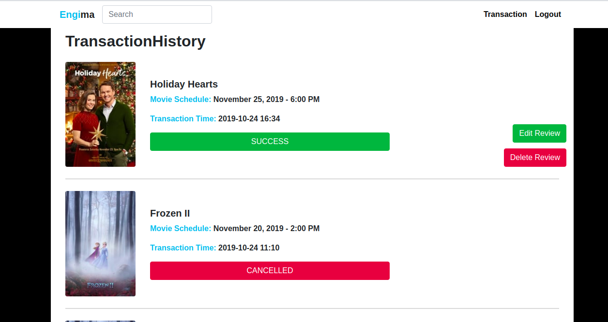
  
6. Review: 
  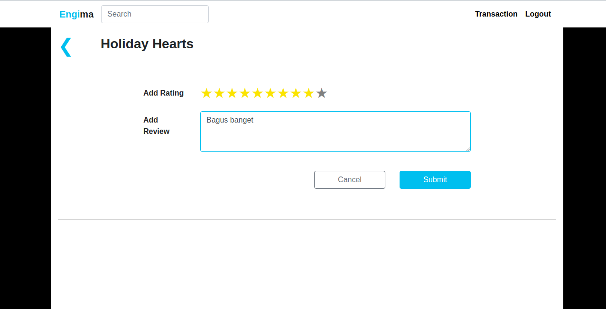
  
7.Search:
  
  
## PEMBAGIAN TUGAS 2

### React - Bank Pro:
1. Login Form: 13517024
2. Transfer Form: 13517024
3. Transaction History: 13517132,13517024
4. Home, UserInfo: 13516138

### Node.js - WS Transaksi:
1. Tambah transaksi baru: 13516138,13517024
2. Ubah transaksi: 13517132,13517024
3. Kasih seluruh data transaksi ke suatu pengguna: 13517024,13517024

### Jax-ws - WS Bank:
1. Validasi no rek: 13516138,13517024
2. Memberi data rekening: 13517132,13517024
3. Melakukan transaksi: 13517024
4. Buat akun virtual: 13517132,13517024
5. Cek ada tidak suatu transaksi: 13517024

### Ubah Engima:
1. Ambil film dari MovieDB API: 13517132
2. Ubah Home, tampil film 7 hari kebelakang: 13516138
3. Detail Page, tambah rating dari MovieDB API: 13517024
4. Buy Ticket Page: 13517024
5. Transaction History, ambil dari WS Transaksi: 13517024
